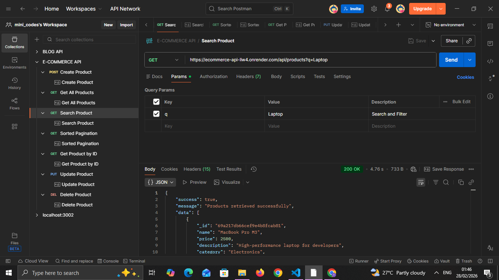
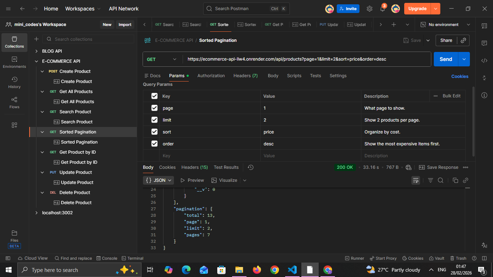
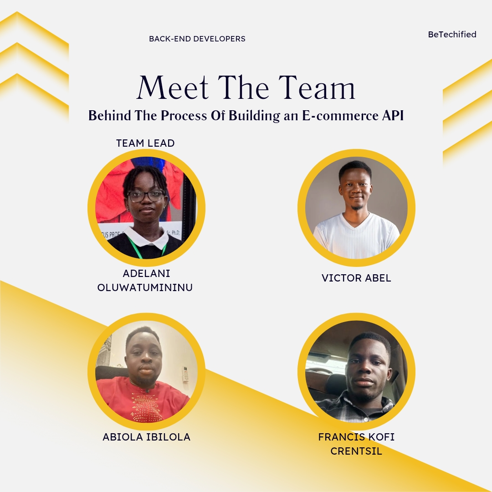

# E-Commerce API 🚀

A robust, production-ready backend for an e-commerce platform built with **Node.js**, **Express**, and **MongoDB Atlas**.

## 🌐 Deployment & Documentation
* **Live API URL:** [https://ecommerce-api-liw4.onrender.com](https://ecommerce-api-liw4.onrender.com)
* **Postman Documentation:** [https://documenter.getpostman.com/view/51991219/2sBXcHhypL]

---

## 🛠️ Project Setup & Architecture
This project follows a professional **MVC (Model-View-Controller)** structure.

### Prerequisites
* Node.js v18+
* MongoDB Atlas Cluster

### Installation
1. Clone the repo: `git clone <https://github.com/minicodes9/ecommerce-api.git>`
2. Install dependencies: `npm install`
3. Configure `.env` file:
   ```env
   PORT=5000
   MONGO_URI=your_mongodb_connection_string
4. Start the server: `npm run dev`

---

## 🔍 Features & API Usage
### 1. Basic CRUD Operations
Create Product (POST): Supports high-fidelity product creation with strict Joi validation.

Read One (GET /:id): Fetches detailed data for a specific item.

Update/Delete: Full lifecycle management of inventory.

### 2. Advanced Querying
Our API implements advanced filtering to enhance user experience:

Text Search: GET /api/products?q=Sony (Searches Name & Description)

Sorting: GET /api/products?sort=price&order=desc (High to Low)

Pagination: GET /api/products?page=1&limit=2

Search & Pagination Proof:





---

## 🛡️ Validation & Error Handling
Input Validation: Joi middleware ensures name, price, and category meet schema requirements.

Error Responses: Returns meaningful JSON error messages and correct HTTP status codes (200, 201, 400, 404, 500).

---

## 👥 The Team
